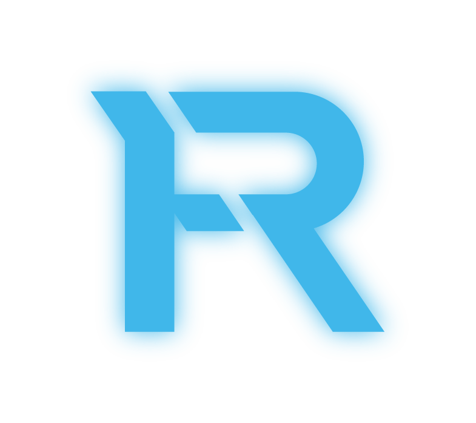

# Regels Ryft Roleplay

  

    Laatste update: 

!!! abstract "Introductie"

    Bedankt voor het bezoeken van de regelpagina van Ryft Roleplay. Dit is de eerste stap om een burger te worden in Ryft Roleplay! 
    Wij zijn een serieuze Roleplay server  voor FiveM en de regels zijn een cruciaal onderdeel om te kunnen spelen in  de stad! 
    Mochten er enige onduidelijkheden zijn over de serverregels is er altijd de mogelijkheidom een support ticket aan te maken in de Support Discord om meer verduidelijk aan te vragen hierover.

Op het moment dat er een regel overtreden wordt probeer dan eerst met degene in kwestie een gesprek aan te gaan voordat je een report aanmaakt tegen de persoon. Dit scheelt voor beide partijen een hoop werk.
Indien het niet mogelijk is om het onderling op te lossen is er altijd de mogelijkheid om deze persoon te rapporteren.

[Onze discord :fontawesome-brands-discord:](https://discord.com/invite/ryftroleplay){ .md-button .md-button--primary} [Support discord :fontawesome-brands-discord:](https://discord.gg/StxSthaSgn){ .md-button}

## Artikel 0: Overige regels en bepalingen
### Artikel 0.1: Staffleden

Een stafflid is een vrijwilliger belast met het handhaven van de regels binnen de community, staffleden worden aangeduid d.m.v. een staffhesje en rollen in de discord server.

### Artikel 0.2: Belangenconflict

Een stafflid mag een staffzaak / geschil NIET behandelen in de volgende gevallen:

- Het stafflid is betrokken in de RP
- Het stafflid is tijdens het conflict in-dienst / aanwezig als/met een van de conflicterende groepen
- Het stafflid heeft hechte banden met betrokken personen buiten de server om.
- Het stafflid mag geen appeal-tickets behandelen die gemaakt zijn tegen zijn/haar gemaakte beslissing.

### Artikel 0.3: Ontduiking / “Bypassing”

Het is verboden een actie uit te voeren met de intentie om aan een regel te ontsnappen.

### Artikel 0.4: “Second opinion” / appeal

Als je het niet eens bent met een sanctie die je opgelegd wordt kan je dit bestrijden in een appeal-ticket. Dit wordt in-game NIET opgelost.

## Artikel 1: Cheating / Valsspelen
### Artikel 1.1: Cheats/Externe software

Het is niet toegestaan om externe software te gebruiken die FiveM beïnvloedt of aanpast

!!! danger "Onder deze externe software valt onder andere:"

    - Cheat Software (zoals EULEN, redENGINE, ...).
    - Custom Crosshairs.
    - Spoofing software.
    - Graphic Packs (Denk hierbij aan graphic packs die bepaalde props verkleinen).
    - Jouw FOV aanpassen via het F8 menu.
    - Het gebruiken van een aangepaste beeldschermresolutie.
    - Tools die sporen verwijderen van je PC.
    - Custom beeldverhouding: Het is niet toegestaan om de beeldscherminstellingen op een custom beeldverhouding in te stellen, waardoor grafische elementen disproportioneel breder worden weergegeven. Je moet de juiste beeldverhouding kiezen die past bij je scherm, deze wordt automatisch gedaan met de "Auto" optie.

*Bij overtreding van deze regel zal er een straf opgelegd worden volgens de 7e tot 10e categorie.*

### Artikel 1.2: Bug/Exploits

Het gebruik maken van bugs/exploits is ten strengste verboden.

!!! bug "Een aantal voorbeelden van bugs zijn:"
    - Duplication glitches.
    - Exploits/bugs die jou voordeel bieden ten opzichte van anderen.

*Bij overtreding van deze regel zal er een straf opgelegd worden volgens de 7e tot 10e categorie.*

### Artikel 1.3: Samenspelen met cheaters

Wanneer je samen met iemand speelt waarbij met redelijkerwijs uit kan blijken dat die persoon artikel 1.1 en of 1.2 verbreekt kan je dezelfde straf krijgen als de overtreder heeft gekregen. 

*Bij overtreding van deze regel zal er een straf opgelegd worden volgens de 7e tot 10e categorie.*

### Artikel 1.4: PC checks  

Het is verplicht om mee te werken aan een PC check wanneer dit uitgevoerd moet worden.
weiger je dit of pas je handelingen aan die een PC check nutteloos maakt kan je worden verbannen met een categorie 10 ban

In onze stad is het verplicht om Windows Defender als virusscanner te gebruiken. Dit is niet alleen een essentieel onderdeel van onze PC Checks (zie hierboven), maar ook een bewuste keuze op basis van veiligheid en betrouwbaarheid. Veel gratis virusscanners bieden namelijk minder uitgebreide bescherming dan Windows Defender, waardoor spelers kwetsbaarder zijn voor bedreigingen.

### Artikel 1.5: Bespreken van Cheats methodes

Het is niet toegestaan om in-game of in Discord te bespreken hoe, waar of op welke manier iets verkregen of gebruikt kan worden.

*Overtreding van deze regel kan resulteren in een categorie 7 ban voor je primaire account en een permanente ban voor je alt-account.*

### Artikel 1.6: Alternatieve account(s)

Het is niet toegestaan om met een alternatief account te spelen. Overtreding van deze regel kan resulteren in een categorie 7 ban.

Het gebruik van een alternatief account om starters geld aan jezelf of vrienden te geven, kan leiden tot een categorie 7 ban, een wipe van je primaire account en een permanente ban van je alternatieve account.

Indien een alternatief account wordt gebruikt om opzettelijk regels te overtreden, zoals RDM of het gebruik van cheats, kan dit resulteren in een permanente ban op zowel je primaire als alternatieve account.

### Artikel 1.7: IRL trading

Het is niet toegestaan om items, diensten, accounts of geld te verhandelen door buiten Ryft om met valuta te betalen of andere vormen van compensatie te accepteren.

*Overtreding van deze regel kan leiden tot categorie 9 ban.*

### Artikel 1.8: Weggeven van spullen bij het stoppen

Het is niet toegestaan om spullen aan anderen weg te geven wanneer je stopt met de server of een lange pauze neemt. Eveneens is het niet toegestaan om dergelijke spullen aan te nemen.

*Overtreding van deze regel kan leiden tot een ban van 3 maanden.*

## Artikel 2 Roleplay
### Artikel 2.1: FailRP

Het uitvoeren van handelingen die in het echte leven niet mogelijk of onrealistisch zouden zijn, is verboden. Hieronder enkele voorbeelden:

!!! question "Voorbeelden van FailRP:"
    - Doen alsof je geen pijn ervaart in situaties waar je dat wel zou moeten.
    - Communiceren via radio of telefoon tijdens het zwemmen.

!!! failure "Verboden handelingen onder FailRP"
    - Het stelen van een voertuig of de inhoud ervan zonder een goede aanleiding.
    - Praten terwijl je dood bent.
    - Opzettelijk een scenario slecht afmaken of verstoren.
    - Niet meewerken na een behandeling door ambulancepersoneel.
    - Het opzetten van een wegblokkade terwijl er nog inzittenden in een voertuig zitten.
    - Na een crash effect of als je voertuig over de kop is gegaan, moet je minimaal 1 minuut in het voertuig blijven zitten. Je mag alleen eerder uitstappen als je door iemand anders uit het voertuig wordt getrokken. Tijdens deze tijd mag je enkel items/wapens droppen, maar niet oppakken of gebruiken.
    - Een voertuig open lassen zonder RP of geldige reden is niet toegestaan. Dit mag alleen als er goede RP aan verbonden is en bij burgers uitsluitend als de bestuurder is gezien bij criminele activiteiten.
    - Het bewust verkopen of weggeven van wapens aan nieuwe spelers (met minder dan één dag playtime) is niet toegestaan.

*Overtredingen van deze regels kunnen resulteren in een straf volgens de 1e tot 4e categorie.*

### Artikel 2.2: Powergaming

Het is niet toegestaan om de keuzevrijheid van een derde afnemen of om opzettelijk een oneerlijk voordeel naar je toe te trekken.

!!! question "Voorbeelden van Powergaming"
    - /me bindt vast.
    - /me pakt communicatiemiddelen af.
    - /me geeft een stoot tegen het hoofd (om dingen te laten vergeten)
    - /me gebruiken voor onrealistische doeleinden.
    - Fictief handelen: Het boeien en/of tiewrappen van personen of spullen afpakken zonder gebruik van de juiste mechanica.
    - ID abuse: ID's gebruiken om spelers te vinden.
    - Confrontaties vermijden: Het vluchten naar je woning om een conflict te ontlopen.
    - Onrealistisch gedrag: Een voertuig op slot zetten nadat het open is gelast.
    - Misbruik van emotes: Emotes zoals /e sleep gebruiken om een schietpartij te ontwijken.
    - Niet eerlijk verkregen wapens: Het fictief pakken van wapens uit een kofferbak waar geen fysiek wapen aanwezig is.
    - Bewijsmateriaal: Bewijsmateriaal IC gebruiken wanneer er geen zichtbare vorm van opname materiaal aanwezig is. Een dashcam valt niet onder geldig opname materiaal.

!!! question "In sommige situaties is dit toegestaan:"
    - Je mag spullen fictief afpakken wanneer je deze items niet mag stelen of af kan afpakken.
    - Wanneer je iemand geboeid hebt, maar door een andere game mechanic moeten de boeien af mag je hem aan een object vast boeien of fictieve boeien gebruiken.
    - Wanneer je een handeling wilt uitvoeren dien je hier een passende emote voor te gebruiken, tenzij je alleen bent dan mag dit vanuit TH.

!!! failure "Uitzonderingen van Powergaming"
    - Overheidsinstanties hebben een bodycam ongeacht of deze zichtbaar is. Deze bodycam kan wel afgepakt worden.
    - Een politie auto heeft een portofoon inbegrepen. Wanneer een agent zijn of haar communicatie dus wordt ingenomen mogen zij via de auto wel terug communiceren.
    - Het fictief boeien van personen wanneer je wel een menu hiervoor hebt om bugs/game mechanics te vermijden.

*Bij overtreding van deze regel zal er een straf opgelegd worden volgens de 1e tot 4e categorie.*

### Artikel 2.3: Metagamen

Gekregen informatie OOC (Out of Character) mag niet worden gebruikt IC (In Character). Dit betekent dat alle informatie die buiten het spel om wordt verkregen, niet mag worden toegepast in de roleplay.

!!! question "Voorbeelden van Metagaming:"
    - Het delen van je scherm in Discord terwijl je in Ryft Roleplay bent.
    - Niet muted en deafened zijn in Discord terwijl je in de server speelt.
    - Het versturen van in-game informatie via Discord of andere externe communicatiekanalen.
    - Het verkrijgen van informatie over een scenario, locatie of andere in-game zaken buiten je karakter om.
    - Streamsniping (het kijken naar een livestream om daar voordeel uit te halen) valt ook onder metagaming en wordt zwaarder bestraft.

    - Het is verboden om samen te spannen met andere spelers buiten de game om en vervolgens deze afspraken in-game toe te passen voor strategische voordelen. Dit omvat maar is niet beperkt tot het vormen van allianties, het plannen van aanvallen.
    - Streamsniping valt ook onder META-gaming. Het is niet toegestaan dat jij informatie via een externe bron verkrijgt (zoals een livestream) en dit toepast in-game om bijvoorbeeld de streamer op te zoeken is niet toegestaan.

Het is ten alle tijden verplicht gesteld om in-game (IC) communicatie te gebruiken. Dit houdt in dat alle betrokken spelers in Ryft Roleplay communiceren of via de (Overheids) TeamSpeak. Het gebruik maken van externe middelen voor communiceren is niet toegestaan.

!!! question "Voorbeelden van externe communicatie:"
    - Discord
    - WhatsApp
    - Snapchat
    - Externe programma's
    - Externe apps

*Bij overtreding van deze regel zal er een straf opgelegd worden volgens de 3e tot 5e categorie.*

### Artikel 2.4: Impersonatie van overheidsmedewerkers

Het is verboden om kleding met overheidslogo’s, markeringen of namen te dragen als je geen actieve overheidsmedewerker bent.

*Bij overtreding van deze regel zal er een straf opgelegd worden volgens de 2e tot 5e categorie.*

### Artikel 2.5: Copbaiten

Het is niet toegestaan om politieagenten uit te lokken.

!!! question "Voorbeelden van copbaiten zijn"

    - Misdragend gedrag vertonen bij of rondom het politiebureau.
    - Het opzoeken van politieagenten om vervolgens overtredingen te begaan om ze achter je aan te krijgen.
    - Het mengen in scenario's met de intentie om ze te irriteren.
    - Onnodig reacties uitlokken van politieagenten om vervolgens een scenario te starten.
    - Een staandehouding of achtervolging uitlokken om een agent te gijzelen.

*Bij overtreding van deze regel zal er een straf opgelegd worden volgens de 1e tot 4e categorie.*

### Artikel 2.6: Karakter breken (OOC)

Out of character (OOC)  praten tijdens een roleplay scenario is niet toegestaan, je kan problemen oplossen via een geschil in /report. Praat je toch OOC tijdens een scenario sta je hoe dan ook in het nadeel en worden alle refunds afgewezen uit de hand van dit scenario, ook word je gestraft met een ban.

*Bij overtreding zal dit resulteren in een straf volgens de 1e tot 2e categorie*

### Artikel 2.7: Karakter

!!! Failure "Voorbeelden van karakter:"
    - Het is niet toegestaan om in de naam van je karakter gegevens onpasselijke of onrealistische dingen in te voeren.
    - Het dragen van helmen als burger is niet toegestaan en mag alleen gebruikt worden wanneer je op een motor rijdt.
    - Het dragen van gezichtsbedekkende kleding als burger is alleen toegestaan wanneer je gezocht wordt of bezig bent met criminele activiteiten.
    - Het gebruiken van de starters-outfit is niet toegestaan. Je dient te allen tijde een eigen outfit te creëren.
    - Het is niet toegestaan om onrealistische kledingstukken te dragen.
    - Het dragen van body armor is alleen toegestaan wanneer je bezig bent met criminele activiteiten.

### Artikel 2.8: New life rule

!!! question "Voorbeelden van een New Life Rule:"

    - Locaties waar zich voorafgaand aan jouw dood belangrijke gebeurtenissen hebben afgespeeld (ripacties, moordacties, …).
    - Wie je van het leven heeft ontnomen.
    - Situaties en aanleidingen waarom iets heeft plaatsgevonden.
    - Zodra een scenario start en jij gedurende dat scenario respawned of uit de gevangenis komt, mag je niet meer koppelen aan datzelfde scenario totdat het voorbij is. Als het scenario vervolgd wordt, bijvoorbeeld iemand die nog wordt aangehouden, valt dit nog steeds onder dit scenario.

*Bij overtreding van deze regel zal er een straf opgelegd worden volgens de 2e tot 5e categorie.*

### Artikel 2.9: No value of Life (NVOL)

In Ryft Roleplay dien je je karakter te spelen alsof het een echt leven heeft. Dit betekent dat je je leven niet onnodig in gevaar brengt zonder een goede reden.

**Categorie A – Geen Wapen / Vuurwapen bij de desbetreffende persoon die NVOL verricht**

!!! example "Voorbeelden:"

    - Gevaarlijke stunts uitvoeren, zoals van hoge daken springen.
    - Bewust gevaarlijke situaties opzoeken zonder geldige reden.
    - Jezelf in gevaar brengen voor sensatie of om anderen te irriteren.

*Straf: Bij overtreding volgt een sanctie volgens de 3e categorie.*

**Categorie B – Geen Wapen / Vuurwapen gericht op de persoon die NVOL verricht**
!!! example "Voorbeelden:"

    - Weglopen van een situatie waarin een wapen op je gericht is, terwijl je geen dreiging vormt.
    
*Straf: Bij overtreding volgt een sanctie volgens de 4e categorie.*

**Categorie C – Wapen / Vuurwapen bij beide partijen**

!!! example "Voorbeelden:"
    - Weglopen van een situatie waarin een wapen op je gericht is, terwijl je wel een dreiging vormt.
    - Hard wegrennen nadat je in je benen bent geschoten/zwaargewond bent.
    - Weerstand bieden nadat je bent overmeesterd of geboeid.

*Straf: Bij overtreding volgt een sanctie volgens de 5e categorie.*

**Categorie D – Terugschieten / Steken terwijl je overmeesterd bent**

!!! example "Voorbeelden:"
    - Terugschieten of iemand steken terwijl er een wapen op je gericht is.
    - Aanvallen terwijl je al geboeid of overmeesterd bent.

*Straf: Bij overtreding volgt een sanctie volgens de 6e categorie.*

### Artikel 2.10: Random Death Match (RDM)

Indien je iemand om het leven wil brengen dient dit te allen tijde met een geldige reden te zijn.

!!! failure "Voorbeelden van RDM:"

    - Iemand omleggen zonder enige vorm van voorafgaande Roleplay.
    - Iemand van het leven ontnemen zonder geldige reden.
    - Het om het leven brengen van iemand die niet meewerkt met het uitvoeren van commando's zoals blaffen.
    - Het om het leven brengen van iemand die ergens van verdacht wordt zonder geldig bewijs.
    - Een massamoord plegen.

*Bij overtreding van deze regel zal er een straf opgelegd worden volgens de 3e tot 5e categorie.*

### Artikel 2.11: Combat stashing

Combat stashen is niet toegestaan, dit houdt in dat het niet is toegestaan om binnen 20 minuten na het verlaten van een scenario je spullen op te slaan of offline te gaan om hiermee confrontaties te voorkomen. Je dient de spullen OP ZAK te houden gedurende deze 20 minuten. Het mag ook in het dashboard/kofferbak van je auto, indien je bij dit voertuig in de buurt blijft.

Je mag *NIET* vliegend in een helikopter deze 20 minuten afwachten.

*Bij overtreding van deze regel zal er een tijdelijke ban van de 9e categorie uitgedeeld worden. (Je dient je dus ook te melden in een ticket voor een gepaste straf.)*

### Artikel 2.12: Combatloggen

Combatloggen houdt in dat een speler de server verlaat tijdens een situatie zoals een achtervolging, ripactie of een moment waar er een roleplay scenario bezig is. Het is dus ten alle tijden verplicht om online te blijven totdat de situatie 20 minuten is afgelopen.

*Bij overtreding van deze regel zal er een tijdelijke ban van de 9e categorie uitgedeeld worden. (Je dient je dus ook te melden in een ticket voor een gepaste straf.)*

## Artikel 3: Het gebruik van microfoon
### Artikel 3.1: Microfoon

Iedere speler is verplicht om een goed werkende en verstaanbare microfoon te gebruiken. Misbruik van de microfoon is verboden en kan leiden tot sancties.

!!! example "Voorbeelden van microfoonmisbruik:"

    - Het earrapen van andere spelers (extreem luide of storende geluiden maken).
    - Het gebruik van soundpads of voice changers om anderen te irriteren.

*Bij overtreding kunnen sancties worden opgelegd afhankelijk van de ernst van de situatie.*

### Artikel 3.2: Stemherkenning

Het is op verschillende manieren mogelijk om een persoon te herkennen aan zijn of haar stem. Hierbij gelden de volgende richtlijnen:

**Herkennen van stem:**

Je mag iemand herkennen aan zijn of haar stem, tenzij je de betreffende persoon IC nog nooit eerder hebt ontmoet.

**Gebruik van externe software:**

Het is toegestaan om externe software te gebruiken om je stem te vervormen voor criminele activiteiten, mits dit op een realistische manier gebeurt. Het is dan niet toegestaan om de persoon te herkennen aan zijn stem.

### Artikel 3.3: Stemvervormers

Het gebruik van stemvervormers is toegestaan, zolang er een geldige reden voor is. Zorg ervoor dat de stemvervorming realistisch en menselijk blijft klinken. Overdreven of onnatuurlijk klinkende stemmen, zoals robot- of babystemmen, zijn niet toegestaan. Je moet verstaanbaar blijven.

## Artikel 4: Het gebruik van voertuigen
### Artikel 4.1: Vehicle Deathmatch (VDM)

Het is niet toegestaan om je voertuig te gebruiken als wapen.
!!! example "Enkele voorbeelden hiervan zijn."

    - Met je voertuig iemand aanrijden om hem te beroven/aan te houden
    - Wanneer iemand voor je voertuig staat is het niet toegestaan om hem aan te rijden. 
    - Op lagere snelheid maximaal 15 km/u is het toegestaan om iemand aan te rijden die een levensgevaarlijke dreiging voor jou of jouw partij vormt. 
    - Onder een levensgevaarlijke dreiging worden ernstige verwondingen of de dood verstaan.

*Bij overtreding van deze regel zal er een tijdelijke ban van de 9e categorie uitgedeeld worden. (Je dient je dus ook te melden in een ticket voor een gepaste straf.)*

### Artikel 4.2: Pitten van voertuigen (VDM)

#### Artikel 4.2.1 Pitten
Het is niet toegestaan om voertuigen te pitten die sneller rijden dan 100 km/u. De verkeerspolitie en de DSI mag een voertuig pitten die niet sneller rijdt dan 150 km/u

#### Artikel 4.2.2 Pittenregels motorvoertuigen
Motorrijders zijn kwetsbare bestuurders, daarom gelden voor hen de volgende regels over het pitten. Tot op de onderstaande aangegeven snelheden mag een motor gepit worden:
!!! warning "Snelheden" 
    - De motor rijdt onder de 50 km/h

#### Artikel 4.2.3 Spijkermatten

Spijkermatten mogen gebruikt worden bij een voertuig dat niet sneller rijdt dan 300 km/u

#### Artikel 4.2.4 Bandenschieten

De politie mag een voertuig banden schieten indien het niet sneller rijdt dan 150 km/u

!!! warning "Voor het schieten op banden van motoren geldt de volgende regel:"
    - De motor rijdt zachter als 50 km/h

#### Artikel 4.2.5 Categorieen

Het is niet toegestaan om een voertuig van een hogere categorie te pitten dan het voertuig dat de pit uitvoert.

- Categorie 1: Voertuigen zonder motor
- Categorie 2: Motoren
- Categorie 3: Normale voertuigen (kleine busjes, supercars en personenauto’s)
- Categorie 4: SUVs
- Categorie 5: Bestelbussen
- Categorie 6: Gepantserde voertuigen (Voertuigen met kogelwerende ramen)
- Categorie 7: Vrachtwagens

#### Artikel 4.2.6 Beuken
Het beuken van voertuigen is niet toegestaan, het klemzetten van een voertuig is wel toegestaan.

*Bij overtreding van deze regel zal er een straf opgelegd worden volgens de 1e tot 4e categorie.*

### Artikel 4.3: Onrealistisch rijgedrag

Het is niet toegestaan om onrealistisch om te gaan met je voertuig

!!! example "Enkele voorbeelden hiervan zijn:"

    - Stunt jumps nemen.
    - Onrealistisch offroad rijden. 
    - Het rammen/onnodig beuken van andere voertuigen zonder reden.
    - Het gebruik maken van obstakels om zo ergens overheen te jumpen of te komen met je voertuig.

*Bij overtreding van deze regel zal er een straf opgelegd worden volgens de 1e tot 4e categorie.*

### Artikel 4.4: Overheidsvoertuigen

- Het is alleen toegestaan om een politievoertuig te stelen wanneer je dit nodig hebt om te vluchten van de politie of voor juiste roleplay doeleinden.. Blijf zo min mogelijk in een politievoertuig en wissel zo snel mogelijk over naar een normale auto.
- Het is niet toegestaan om een ambulance of ANWB voertuig te stelen.

*Bij overtreding van deze regel zal er een straf opgelegd worden volgens de 1e tot 4e categorie.*

## Artikel 5: Wapens

### Artikel 5.1 Finishing

Een zwaargewonde speler mag enkel gefinisht worden bij pure noodzaak, in andere situaties dien je de persoon te laten leven, dit om ambulance roleplay en speelplezier voor alle partijen te stimuleren.

*Bij overtreding van deze regel zal er een straf opgelegd worden volgens de 1e tot 4e categorie.*

## Artikel 6: Onderwereld/Criminaliteit
Criminaliteit is een onlosmakelijk onderdeel van Ryft. Om de balans tussen roleplay en fair play te waarborgen, gelden de volgende regels voor criminele activiteiten binnen de stad en daarbuiten.

### Artikel 6.1: Rippen en Overvallen 
#### 6.1.1 Algemene regels overvallen

- Het beroven van een speler is toegestaan wanneer diegene aantoonbaar bezig is met criminele activiteiten.
- De overval moet binnen 20 minuten na herkenning plaatsvinden. Na deze tijd is rippen niet meer toegestaan.

#### 6.1.2 Toegestane redenen om iemand te rippen

!!! example "Voorbeelden van situaties waarin rippen is toegestaan:"

    - Het dragen van gezichtsbedekkende kleding.
    - Het dragen van een motorhelm terwijl de speler niet op een motor zit.
    - Het dragen van een holster, steek/kogelwerend vest of legerkleding.
    - Het zichtbaar vasthouden van een wapen.
    - Het achtervolgen van gewapende mensen langer dan 2 minuten.
    - Handelingen uitvoeren op roterende drugs- of witwaslocaties.

#### 6.1.3 Situaties waarin rippen niet is toegestaan

- Spelers zonder criminele indicatie (bijvoorbeeld willekeurige burgers).
- Startlocaties van illegale activiteiten.

#### 6.1.4 Verboden items bij rippen

!!! example "De volgende items mogen niet worden gestolen tijdens een overval of rip-actie:"

    - Job items (legaal).
    - Overheidsitems (zoals dienstwapens of apparatuur, ter herkennen aan het serienummer 'OVERHEID').
    - Sleutels van gebouwen of woningen.
    - Geld van een bankrekening.
    - Spullen die zich in een kluis bevinden.
    - Items met een beveiligde tag (vb.: management pizza, andere ingame staff-items, ...).
    - Donateurs items

### Artikel 6.2: Counteren

Counteren is enkel en alleen toegestaan wanneer de politie nog niet ter plaatse of betrokken is. Zodra politie deelneemt aan het scenario, blijf je als derde partij uit het scenario.

### Artikel 6.3: Gangs en Organisaties

- Een gang mag maximaal 10 leden hebben.
- Indien de helft van het totale aantal gangleden online zijn, mogen er maximaal 2 meelopers (spelers die niet in de gang zitten) deelnemen aan een actie.
- Indien je gang meer dan 4 leden bevat, mag je niet samenwerken met gangs die ook meer dan 4 leden hebben.

### Artikel 6.4: Overvallen

Overvallen op jachten, banken en winkels mogen plaatsvinden onder de volgende voorwaarden:

- Gegijzelde personen mogen geen vriend of bekende zijn.
- Er mag geen overval gestart worden binnen een halfuur voor een server restart.
- Na een succesvolle overval mag een crimineel niet binnen 5 minuten al op de politie schieten, tenzij de politie de gestelde eisen verbreekt.
- Zodra de politie aanwezig is bij een overval, is het niet toegestaan om deze te counteren.
- Counteren tijdens de achtervolging tussen een andere groepering en de politie is niet toegestaan (zie Artikel 6.2)

### Artikel 6.5: Vrijheidsberoving

- Je mag iemand enkel gijzelen als dit een rol speelt binnen een roleplay scenario zoals een bankoverval of wraakactie.
- Verboden doelwitten: Ambulancepersoneel en ANWB-medewerkers mogen niet worden gegijzeld.
- Maximaal 1/3 van de aanwezige agenten mag gegijzeld worden met een maximum van 5 gegijzelde agenten tegelijkertijd.
- Je mag iemand maximaal 30 minuten gijzelen alvorens een scenario te starten (overval, wraakactie), start je niks binnen die tijd, dan moet de gegijzelde vrijgelaten worden.
- Je mag geen vrienden of bekenden als hostage gebruiken om een overval te plegen.
- Het gebruik van een “outside” hostage is niet toegestaan (de hostage moet dus altijd op dezelfde plaats zijn als waar de onderhandelingen plaatsvinden).

### Artikel 6.6: Wraak acties

Onder de term wraakacties wordt er verwezen naar het afspelen van een eerdere gebeurtenis of interactie. Wraakacties mogen uitgevoerd worden tot een server restart. Een uitzondering hiervoor geldt op het moment dat de server crashed of dat er een geforceerde restart ingepland wordt.

!!! success "Een aantal voorbeelden van wraakacties:"

    - Het nemen van een wraakactie na een eerdere confrontatie: Op het moment dat er zich eerder een interactie heeft afgespeeld zoals een ripactie of oneerlijkheid tijdens een eerdere meeting.
    - Bij schade of verlies: Op het moment dat jij bijvoorbeeld spullen bent kwijtgeraakt of als jij gewond bent geraakt dan is het toegestaan om wraak te nemen door bijvoorbeeld de persoon te gijzelen of in het ergste geval te vermoorden.
    - Verraad of bedrog: Als jij wordt verraden door iemand is het toegestaan om wraak te nemen door bijvoorbeeld die persoon te overvallen en zijn of haar items te confisqueren.

!!! failure "Een aantal voorbeelden waarin het niet toegestaan is om een wraakactie uit te voeren:"

    - Een agent die een boete uitschrijft: Op het moment dat een agent een boete uitschrijft is het niet toegestaan om wraak te nemen. De boete dient geaccepteerd te worden tenzij het mogelijk is om binnen RP de situatie op een andere manier op te lossen.
    - Op het moment dat jij overleden bent is het in zijn geheel niet meer toegestaan om wraak te nemen i.v.m. de New Life Rule (NLR).
    - Onbedoelde confrontatie: Op het moment dat iemand zonder de intentie schade of iets toericht bij jou is het niet toegestaan om wraak te nemen hierop.
    - Direct na een scenario met de ambulance. Pas na 5 minuten zonder ambulance roleplay is het weer toegestaan om verder te handelen met een persoon.
    - Zodra een persoon gerespawned is heeft geen van beide partijen meer het recht om nog wraak te nemen op elkaar.
    - Op het moment dat een ambtenaar een arrestatie heeft verricht is het niet toegestaan om vervolgens wraak te nemen op de desbetreffende ambtenaar of andere ambtenaren.

Indien goedgekeurd door management, kan een wraakactie aanleiding zijn tot een 'gangwar' waarbij de tijdslimieten van wraakacties vervallen.

*Bij overtreding van deze regel zal er een straf opgelegd worden volgens de 1e tot 4e categorie.*

### Artikel 6.7: Drugsproductie

Het verwerken of produceren van drugs door middel van plaatsbare objecten zijn niet toegestaan in huizen (uitgezonderd MLO's Die niet in bezit zijn)  of plaatsen waar het niet mogelijk is om te komen. 

Deze objecten dienen bovendien op een realistische plek geplaatst te worden. Op een steile helling een tafel plaatsen is dus verboden.

*Bij overtreding van deze regel zal er een straf opgelegd worden volgens de 1e tot 4e categorie. Ook worden de spullen afgepakt.*

## Artikel 7: Scammen
### Artikel 7.1: Verbod op scams met voertuigen

Het scammen met voertuigen is ten strengste verboden.

*Bij overtreding van deze regel zal er een straf opgelegd worden volgens de 1e tot 4e categorie.*

### Artikel 7.2: Verantwoordelijkheid bij aankoop van voertuigen

Bij het kopen van een voertuig ben je zelf verantwoordelijk voor het controleren van alle aangeboden upgrades.
Voordat de transactie plaatsvindt, moet je verifiëren of de upgrades daadwerkelijk aanwezig zijn.

### Artikel 7.3: Uitlenen van bezittingen op eigen risico

Het uitlenen van voertuigen, geld of andere bezittingen gebeurt volledig op eigen risico.
Er vindt geen refund of transfer plaats als iemand besluit niet terug te betalen of als een speler wordt verbannen.

### 7.4 Het scammen of ripdealen van illegale goederen

Het is toegestaan om mensen te scammen of ripdealen voor illegale goederen. Wraakacties naar aanleiding van ripdeals of oplichtingen zijn toegestaan. Zorg dus dat je goed weet met wie je zaken doet.

## Artikel 8: Bovenwereld/ambtenaren

**Algemeen**
Ambtenaren zijn spelers met toegang tot speciale acties binnen een overheidsorganisatie (zoals Politie, Ambulance en Pechhulp). Deze functie brengt verantwoordelijkheid en voorbeeldgedrag met zich mee.

??? Failure "Verboden gedragingen tijdens of na diensttijd"

    - Deelname aan illegale activiteiten is verboden. (Uitzondering: Pechhulp en Ambulance mogen dit buiten dienst wel)
    - Het is verboden om overheidsmiddelen zoals een taser, dienstwapen of medische spullen bij je te dragen wanneer je niet in dienst bent.
    - Na ontslag mag je geen informatie gebruiken die je tijdens je diensttijd hebt verkregen.
    - Het combineren van je overheidsfunctie met een andere baan waarvoor je in dienst moet zijn, is niet toegestaan.
    - Dienstvoertuigen mogen nooit worden ingezet voor illegale activiteiten.
    - Instappen bij criminelen of actief meedoen aan criminele situaties is verboden.
    - Farmen van geld binnen een overheidsbaan (bijvoorbeeld door onnodig acties te herhalen voor salaris) is niet toegestaan.
    - Testritten of verkoop van voertuigen tijdens diensttijd is verboden.
    - Het verduisteren van goederen of doorspelen van gevoelige informatie is strafbaar. Denk aan:
        - MDT-gegevens
        - Interne documenten of dossiers
    - Hangen op gang- of crimineel terrein (in of uit dienst) zonder reden is niet toegestaan. Alleen meldingen afhandelen is toegestaan.
    - Overheidsmedewerkers mogen niet worden aangespoord tot corrupt gedrag.

!!! Example "Onder corrupt gedrag verstaan we o.a.:"

    - Geld geven of aannemen om meldingen voorrang te geven.
    - Gevoelige informatie doorspelen aan criminelen.
    - Gebruik van je functie om vrienden in de onderwereld te helpen.
    - Betrokkenheid bij criminele activiteiten, ook na ontslag.
    - Het misbruiken van dienstmiddelen of bevoegdheden voor eigen of andermans voordeel.

## Artikel 9: Twitter

Het gebruik van Twitter binnen Ryft Roleplay is bedoeld voor realistische en gepaste communicatie. Spammen of misbruik van Twitter is niet toegestaan.

### Artikel 9.1 - Verbod op illegale activiteiten via Twitter

- Het plaatsen van berichten over illegale activiteiten (zoals wapenhandel, drugsverkoop en illegale locaties) op Twitter is verboden.
- Het gebruik van codewoorden die indirect verwijzen naar illegale activiteiten, zoals "Gezocht: snoepjes", is eveneens niet toegestaan.
- Illegale activiteiten mogen alleen worden gedeeld via Dark Web of Messages binnen roleplay.

## Artikel 10 : Taalgebruik & gedrag
### Artikel 10.1: Taalgebruik

Het gebruik maken van ongepaste taal zal bestraft worden met een ban.

Voorbeelden van ongepast taalgebruik:

- Het gebruik maken van ziektes die niet bedoeld zijn om iemand mee te beledigen.
- Iemand persoonlijk beledigen.
- Iemand beledigen met ziektes.
- Iemand beledigen en zijn/haar familie erbij betrekken.
- Racistische/seksistische opmerkingen.
- Het opzettelijk vernederen van andere personen

*De straf kan variëren van de 1e categorie tot de 7e categorie, afhankelijk van de ernst van de overtreding, in te schatten door het handelende stafflid.*

### Artikel 10.2 Gedrag

Bij Ryft Roleplay staat respect centraal. Respectloos, intimiderend of verstorend gedrag wordt niet getolereerd, zowel in-game als op alle aan de community gerelateerde communicatiekanalen, waaronder Discord.

De straf kan variëren van de 1e categorie tot de 7e categorie, afhankelijk van de ernst van de overtreding, ter beoordeling van het handelende stafflid.

#### 10.2.1 - Respectvol gedrag

Het is verboden om:

Andere spelers of communityleden opzettelijk te provoceren, frustreren of lastig te vallen.
Beledigend, discriminerend, respectloos of onnodig agressief gedrag te vertonen.
Te dreigen, te intimideren of anderen onder druk te zetten.
De sfeer binnen de community op negatieve wijze te verstoren.

#### 10.2.2 - Respect voor staffleden

Staffleden dienen te allen tijde met respect behandeld te worden. Het beledigen, uitschelden, intimideren of op andere wijze respectloos behandelen van staffleden is verboden.

## Artikel 11: luchtregels
### Artikel 11.1: Algemene vliegregels

Het is enkel toegestaan om te vliegen met een geldig vliegbrevet. De luchtverkeersregels in Ryft zijn opgesteld om het vliegverkeer veilig en ordelijk te laten verlopen.

!!! Info "Veiligheid"
    - Meld eventuele technische problemen in de portofoon en volg de instructies van de autoriteiten op.
    - Het opzettelijk laten crashen van je luchtvaartuig is ten strengste verboden (Straf Categorie 5).

### Artikel 11.2: Vlieghoogte

- De minimale vlieghoogte binnen Ryft is vastgesteld op 100 meter.
- Indien je zonder intentie tot roleplay of scenario onder deze hoogte gaat vliegen kan hier een straf van de 1e tot 3e categorie voor opgelegd worden. Anders wordt dit door de politie in roleplay afgehandeld.

### Artikel 11.3: Communicatie en portofoon

- Piloten dienen zich voorafgaand aan de vlucht aan te melden via portofoon **frequentie 23.45.**
- Dit is noodzakelijk om coördinatie en veiligheid in de lucht te waarborgen.
- De overheid kan direct contact met je opnemen bij ongewone activiteit.

### Artikel 11.4: Aanwijzingen van autoriteiten

- Aanwijzingen van de politie of andere autoriteiten moeten te allen tijde worden opgevolgd.
- Indien je deze instructies negeert, kan je vliegbrevet worden ingetrokken en kunnen er verdere maatregelen worden genomen.

### Artikel 11.5: No-Fly zones

!!! Failure "Binnen en buiten de stad gelden enkele No-Fly zones:"
    - De militaire basis
    - Het vliegdekschip
    - De gevangenis
    - Alle overheidsgebouwen (inclusief ziekenhuizen en politiebureaus)

Het vliegen boven deze locaties zonder speciale toestemming is ten strengste verboden.

### Artikel 11.6: Landingsregels

**Verboden landingslocaties:**

- Drukke wegen en stadscentra.
- Onverharde ondergronden zonder voldoende stabiliteit.
- Locaties binnen 75 meter van obstakels zoals powerlines, daken en lantaarnpalen.
- Militaire bases en vliegdekschepen.

**Toegestane landingslocaties:**

- Helikopterdekken
- Landingsbanen en vliegvelden
- Vlakke stukken land buiten de stad (mits voldoende afstand tot gebouwen en bomen)
- Water (alleen voor watervliegtuigen en waterhelikopters)

### Artikel 11.7: Overtredingen en sancties

- Indien je je niet aan de vliegregels houdt, heeft de politie het recht om je vliegbrevet in te nemen.
- Ernstige overtredingen kunnen resulteren in een straf van de 1e tot 5e categorie of een tijdelijk of permanent vliegverbod binnen Ryft.

### Artikel 11.8: Uitzonderingen

- Ambulance- en politiehelikopters zijn uitgezonderd van de bovengenoemde regels.
- Zij zijn bevoegd om laag te vliegen en te landen op alle locaties, mits dit veilig en noodzakelijk is.

## Artikel 12: Huizen

### Artikel 12.1: Meubels
Het is niet toegestaan om misbruik te maken van meubels binnen of buitens huis.

!!! Failure "Enkele voorbeelden hiervan"
    - Opslag buiten plaatsen
    - Meubels onrealitsch plaatsen
    - Meubels gebruiken om delen van je af te blokeren of om opslag te verbergen.
    - Verlichting misbruiken om mensen te verblinden. 

*Bij overtreding van deze regel zal er een straf opgelegd worden volgens de 1e tot 4e categorie. Ook kan een huis/inboedel inbeslag genomen worden.*

